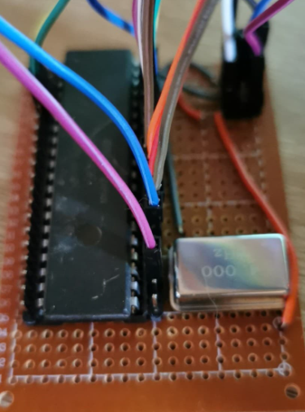
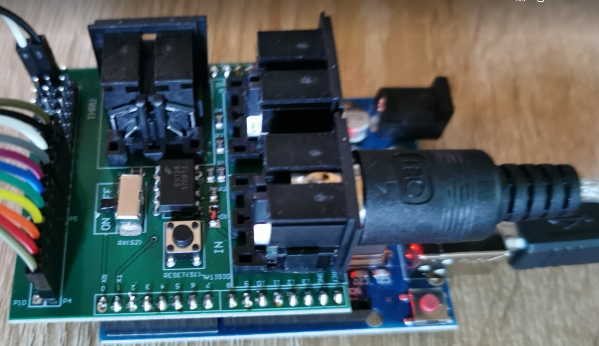

# SSG-Synth
YM2149F SSG audio synthesizer with midi interface.
The project is designed for Arduino Uno or Nano, compatibility with other hardware is not assured (but should not be a problem).

This project uses a lot of resource from one of my old abandoned projects [Yt-trium/Arduino-YM-Sound-Chips](https://github.com/Yt-trium/Arduino-YM-Sound-Chips)

If you are interested about more use of the YM2149 (SSG) chip, like streaming, reading SNDH files, I recommend the work of [ FlorentFlament](https://github.com/FlorentFlament) :
* [FlorentFlament/ym2149-test](https://github.com/FlorentFlament/ym2149-test)
* [FlorentFlament/ym2149-streamer](https://github.com/FlorentFlament/ym2149-streamer)
* [FlorentFlament/ym2149-sndh](https://github.com/FlorentFlament/ym2149-sndh)

This project use the [Arduino MIDI Library](https://github.com/FortySevenEffects/arduino_midi_library) from [ FortySevenEffects](https://github.com/FortySevenEffects)


### Roadmap
*0.x, make it work*
* 0.0 :heavy_check_mark: create Arduino and GitHub project :smile:
* 0.1 :heavy_check_mark: [hardware] setup and document project (YM2149F breadboard setup, midi interface)
* 0.2 :heavy_check_mark: [code] control SSG chip using an Arduino Uno
* 0.3 :heavy_check_mark: [code] receive midi signals with Arduino
* 0.4 :heavy_check_mark: [code] control SSG chip using midi signals
* 0.5 :heavy_check_mark: [hardware] from breadboard to custom shield / PCB
* 0.6 :heavy_check_mark: [doc] examples and tutorial
* 0.7 :heavy_check_mark: It's working ! It's working !

*A.x, add features to make it cool :smile:*
* A.1 :heavy_check_mark: [code] support velocity
* A.2 :heavy_check_mark: [code] add second operating mode : polyphonic 3 voice
* A.3 :x: [hardware] add hardware control support for envelope selection and frequency
* A.4 :x: [code] envelope selection and frequency
* A.5 :x: [code] reduce delay (reduce until it no longer works)

*B.x, fix issues*
* B.1 :x: bad frequency / bug with notes inferior to C2
* B.2 :x: cracking sound bug (append randomly)
  * may possibly come from the midi interface, DAW software or Arduino midi library, to investigate
* B.3 :heavy_check_mark: cracking sound after "note off" when note is already off
  * set_chan_mixer make this noise, avoided when possible using set_chan_level_null

**1.0 :x: works with all major features and no known bugs**

*1.0x, non-essential improvement*
* 1.01 :x: hardware operating mode selection
* 1.02 :x: hardware channel selection
* 1.03 :x: Eurorack dimension module


## Documentation
### Create your own
*Basic synth setup (+/- 15€)*
Components :
* Arduino Uno/Nano
* MIDI Shield
* YM2149F
* 4MHz Active Crystal Oscillator
* 2 Prototype PCB
* resistor (1x100Ω + 3x1kΩ)

**Troubleshooting**
* Avoid using a breadboard for the YM2149F, this often tends to create connection problems, prefer the soldering on a custom PCB.

### Schematics
#### YM2149F setup
```
+-----------------+             +------------------+
|    +-------+    |             |  +------------+  |
|    |YM2149F|    |             |  |   ARDUINO  |  |
|    +-------+    |             |  | UNO / NANO |  |
|                 |             |  +------------+  |
|                 |             |                  |
|        D0 -> D7 +-------------+ PIN 5 -> 12      |
|                 |             |                  |
|    BC1,BC2,BDIR +-------------+ PIN 4,3,2        |
|                 |             |                  |
|      CHAN A,B,C +-- MIXER     |                  |
|                 |             |                  |
|                 |             |                  |
|          /RESET +-- 5V        |                  |
|                 |             |                  |
|            /SEL +-- GND       |                  |
|                 |             |                  |
|           CLOCK +------+      |                  |
|                 |      |      |                  |
+-----------------+      |      +------------------+
                         |
                         |
+---------------------+  |
| +-----------------+ |  |
| | 4Mhz oscillator | |  |
| ++----------------+ |  |
|                     |  |
| 5V              OUT +--+
|                 GND |
+---------------------+
```

#### Passive audio mixer
```
           +----------------+
           |                |
           | +------+       |
    GND ---+-+ 100Ω |--+    |
             +------+  |    |
                       |    |
             +------+  |    |
 CHAN A -----+ 1k Ω +--+    +---- OUT (GND)
             +------+  |
                       +--------- OUT (SIGNAL)
             +------+  |
 CHAN B -----+ 1K Ω +--+
             +------+  |
                       |
             +------+  |
 CHAN C -----+ 1K Ω +--+
             +------+
```

#### MIDI Interface setup
```
+------------------+    +---------------+
|  +------------+  |    | +-----------+ |
|  |   ARDUINO  |  |    | |   MIDI    | |
|  | UNO / NANO |  |    | | INTERFACE | |
|  +------------+  |    | +-----------+ |
|                  |    |               |
|               TX +----+ * * * * * * * + MIDI OUT
|                  |    |               |
|               RX +----+ * * * * * * * + MIDI IN
|                  |    |       *       |
|                  |    |       * * * * + MIDI THRU
|                  |    |               |
+------------------+    +---------------+
```

#### YM2149F pinout


### What does it look like ?

### 0.5 setup : from breadboard to custom shield / PCB
YM2149F + oscillator on PCB | Arduino + MIDI interface
--- | ---
|  |  |

### 0.3 setup : Arduino + MIDI interface = blink led
**WARNING: the MIDI interface is not of our design, the schematic is an approximation.**
Interface | MIDI input approximative schematic
--- | ---
|  |  |

### 0.2 setup : Arduino + SSG = sound
Mixer | YM2149F + oscillator on breadboard | Arduino
--- | --- | ---
|  |  |  |
