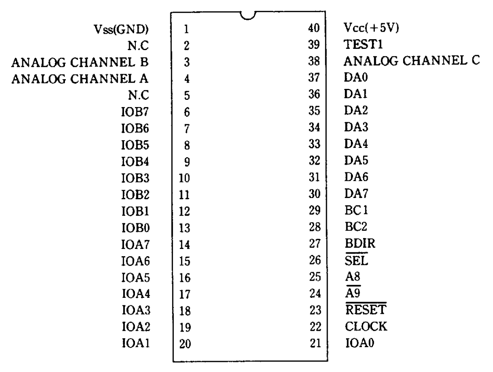
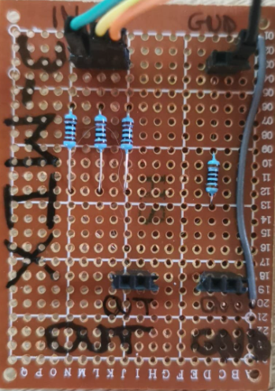
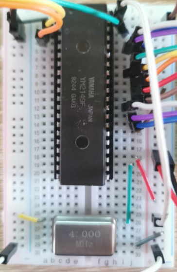
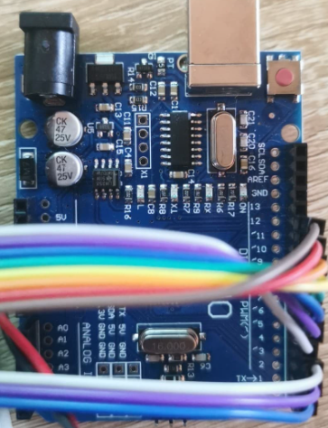
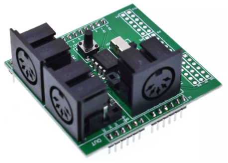
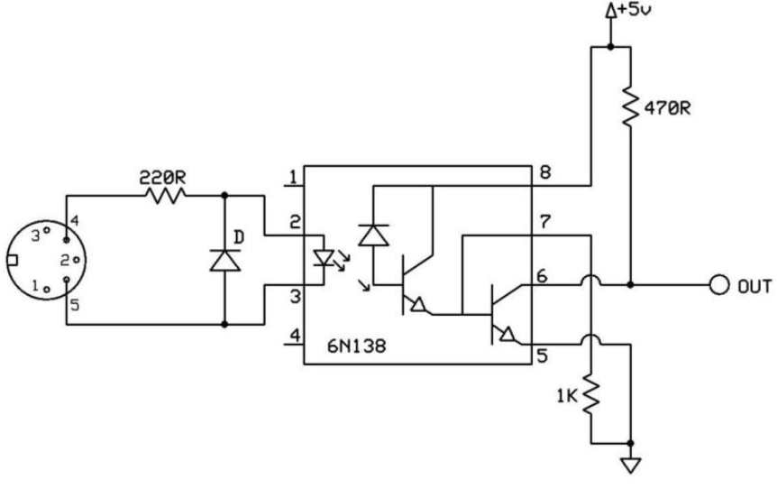

# SSG-Synth
YM2149F SSG audio synthesizer with midi interface.
The project is designed for Arduino Uno or Nano, compatibility with other hardware is not assured (but should not be a problem).

This project uses a lot of resource from one of my old abandoned projects [Yt-trium/Arduino-YM-Sound-Chips](https://github.com/Yt-trium/Arduino-YM-Sound-Chips)

If you are interested about more use of the YM2149 (SSG) chip, like streaming, reading SNDH files, I recommend the work of [ FlorentFlament](https://github.com/FlorentFlament) :
* [FlorentFlament/ym2149-test](https://github.com/FlorentFlament/ym2149-test)
* [FlorentFlament/ym2149-streamer](https://github.com/FlorentFlament/ym2149-streamer)
* [FlorentFlament/ym2149-sndh](https://github.com/FlorentFlament/ym2149-sndh)


### Roadmap
* 0.0 :heavy_check_mark: Create Arduino and GitHub project :smile:
* 0.1 :heavy_check_mark: [hardware] setup and document project (YM2149F breadboard setup, midi interface)
* 0.2 :x: [code] control SSG chip using an Arduino Uno
* 0.3 :x: [code] receive midi signals with Arduino
* 0.4 :x: [code] control SSG chip using midi signals
* 0.5 :x: [hardware] from breadboard to custom shield
* 0.6 :x: [doc] examples and tutorial


### Tutorial: Create your own
*TODO* :smile:


# Schematics
### YM2149F setup
```
+-----------------+             +------------------+
|    +-------+    |             |  +------------+  |
|    |YM2149F|    |             |  |   ARDUINO  |  |
|    +-------+    |             |  | UNO / NANO |  |
|                 |             |  +------------+  |
|                 |             |                  |
|        D0 -> D7 +-------------+ PIN 5 -> 12      |
|                 |             |                  |
|    BC1,BC2,BDIR +-------------+ PIN 4,3,2        |
|                 |             |                  |
|      CHAN A,B,C +-- MIXER     |                  |
|                 |             |                  |
|                 |             |                  |
|          /RESET +-- 5V        |                  |
|                 |             |                  |
|            /SEL +-- GND       |                  |
|                 |             |                  |
|           CLOCK +------+      |                  |
|                 |      |      |                  |
+-----------------+      |      +------------------+
                         |
                         |
+---------------------+  |
| +-----------------+ |  |
| | 4Mhz oscillator | |  |
| ++----------------+ |  |
|                     |  |
| 5V              OUT +--+
|                 GND |
+---------------------+
```

### Passive audio mixer
```
           +----------------+
           |                |
           | +------+       |
    GND ---+-+ 100Ω |--+    |
             +------+  |    |
                       |    |
             +------+  |    |
 CHAN A -----+ 1k Ω +--+    +---- OUT (GND)
             +------+  |
                       +--------- OUT (SIGNAL)
             +------+  |
 CHAN B -----+ 1K Ω +--+
             +------+  |
                       |
             +------+  |
 CHAN C -----+ 1K Ω +--+
             +------+
```

### MIDI Interface setup
```
+------------------+    +---------------+
|  +------------+  |    | +-----------+ |
|  |   ARDUINO  |  |    | |   MIDI    | |
|  | UNO / NANO |  |    | | INTERFACE | |
|  +------------+  |    | +-----------+ |
|                  |    |               |
|               TX +----+ * * * * * * * + MIDI OUT
|                  |    |               |
|               RX +----+ * * * * * * * + MIDI IN
|                  |    |       *       |
|                  |    |       * * * * + MIDI THRU
|                  |    |               |
+------------------+    +---------------+
```

### YM2149F pinout



# What does it look like ?
### 0.2 setup : Arduino + SSG = sound
Mixer | YM2149F + oscillator on breadboard | Arduino
--- | --- | ---
|  |  |  |

### 0.3 setup : Arduino + MIDI interface = blink led
**WARNING: the MIDI interface is not of our design, the schematic is an approximation.**
Interface | MIDI input approximative schematic
--- | ---
|  |  |
